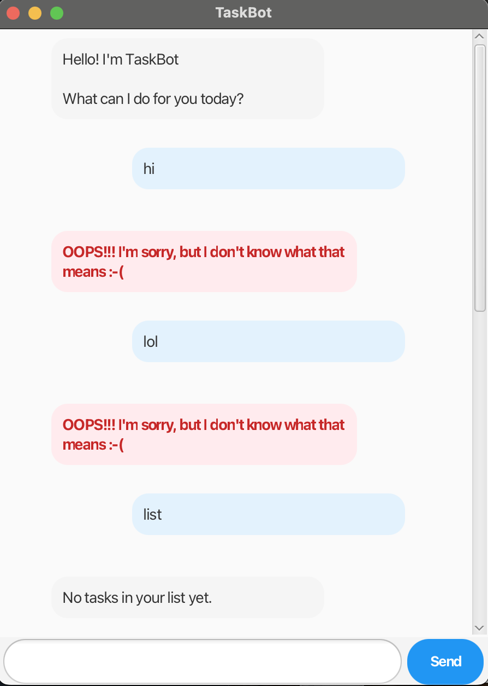

# TaskBot User Guide



## Welcome to TaskBot!

**TaskBot** is your friendly desktop task manager that helps you keep track of your todos, deadlines, and events. With an intuitive chat interface and smart command suggestions, managing your tasks has never been easier!

## Quick Start

1. Download the latest release from the [releases page](https://github.com/aliensarefake/ip/releases)
2. Double-click the JAR file to launch TaskBot
3. Start managing your tasks with simple commands!

## Features

### Adding Tasks

TaskBot supports three types of tasks:

#### 1. Todo - Simple tasks without dates

Add a basic task to your list.

**Format:** `todo DESCRIPTION`

**Example:**
```
todo Read Chapter 5
```

**Expected Output:**
```
Got it. I've added this task:
  [T][ ] Read Chapter 5
Now you have 1 task in the list.
```

#### 2. Deadline - Tasks with a due date

Add a task that needs to be completed by a specific date/time.

**Format:** `deadline DESCRIPTION /by DATE_TIME`

**Example:**
```
deadline Submit assignment /by 2024-12-25
```

**Expected Output:**
```
Got it. I've added this task:
  [D][ ] Submit assignment (by: Dec 25 2024)
Now you have 2 tasks in the list.
```

#### 3. Event - Tasks with start and end times

Add an event with a specific time period.

**Format:** `event DESCRIPTION /from START_TIME /to END_TIME`

**Example:**
```
event Team meeting /from 2pm /to 4pm
```

**Expected Output:**
```
Got it. I've added this task:
  [E][ ] Team meeting (from: 2pm to: 4pm)
Now you have 3 tasks in the list.
```

### Managing Tasks

#### List all tasks

View all your tasks at once.

**Format:** `list`

**Example:**
```
list
```

**Expected Output:**
```
Here are the tasks in your list:
1.[T][ ] Read Chapter 5
2.[D][ ] Submit assignment (by: Dec 25 2024)
3.[E][ ] Team meeting (from: 2pm to: 4pm)
```

#### Mark task as done

Mark a task as completed using its number from the list.

**Format:** `mark TASK_NUMBER`

**Example:**
```
mark 1
```

**Expected Output:**
```
Nice! I've marked this task as done:
  [T][X] Read Chapter 5
```

#### Unmark task

Mark a completed task as not done yet.

**Format:** `unmark TASK_NUMBER`

**Example:**
```
unmark 1
```

**Expected Output:**
```
OK, I've marked this task as not done yet:
  [T][ ] Read Chapter 5
```

#### Delete task

Remove a task from your list permanently.

**Format:** `delete TASK_NUMBER`

**Example:**
```
delete 2
```

**Expected Output:**
```
Noted. I've removed this task:
  [D][ ] Submit assignment (by: Dec 25 2024)
Now you have 2 tasks in the list.
```

### Finding Tasks

#### Search by keyword

Find tasks containing specific keywords.

**Format:** `find KEYWORD`

**Example:**
```
find meeting
```

**Expected Output:**
```
Here are the matching tasks in your list:
1.[E][ ] Team meeting (from: 2pm to: 4pm)
```

### Exiting the Application

#### Save and exit

Exit TaskBot. Your tasks are automatically saved.

**Format:** `bye`

**Example:**
```
bye
```

**Expected Output:**
```
Bye. Hope to see you again soon!
```

## Smart Features

### Error Handling
TaskBot provides helpful error messages when commands are incorrect:
- Suggests correct commands for common typos (e.g., "exit" → "bye")
- Highlights errors in red for better visibility
- Provides clear format instructions for complex commands

### Visual Design
- **Blue messages** - Your inputs
- **Grey messages** - TaskBot's responses
- **Red messages** - Error notifications
- **Circular profile pictures** - Clean, modern look
- **Resizable window** - Adjust to your preference

## Data Storage

Your tasks are automatically saved to `data/taskbot.txt` in the same directory as the application. The data persists between sessions, so you never lose your tasks!

## Command Summary

| Command | Format | Example |
|---------|--------|---------|
| Add todo | `todo DESCRIPTION` | `todo Buy groceries` |
| Add deadline | `deadline DESCRIPTION /by DATE` | `deadline Submit report /by Friday` |
| Add event | `event DESCRIPTION /from TIME /to TIME` | `event Meeting /from 2pm /to 3pm` |
| List tasks | `list` | `list` |
| Mark as done | `mark INDEX` | `mark 2` |
| Unmark | `unmark INDEX` | `unmark 2` |
| Delete | `delete INDEX` | `delete 3` |
| Find | `find KEYWORD` | `find book` |
| Exit | `bye` | `bye` |

## FAQ

**Q: Where is my data saved?**
A: Your tasks are saved in `data/taskbot.txt` in the application directory.

**Q: Can I edit the data file directly?**
A: It's not recommended as it may corrupt your data. Use TaskBot commands instead.

**Q: What date formats are accepted?**
A: TaskBot accepts various formats like "2024-12-25", "tomorrow", "next Monday", etc.

**Q: How do I report issues?**
A: Please create an issue on our [GitHub repository](https://github.com/aliensarefake/ip/issues).

---

**Happy task managing with TaskBot!** 🤖